= FreeNAS
UCLL
:doctype: article
:encoding: utf-8
:lang: nl
:toc: left
== SYSVOL en NETLOGON

In voorgaande labo's hebben we een domeincontroller COSCIDC1 opgezet, hebben we een Windows 10 machine opgenomen in het domein, gewerkt met GPO's en gedeelde mappen aangemaakt die bereikbaar zijn vanop het netwerk.

Deze gedeelde mappen hebben we gemaakt op een domeincontroller zelf.

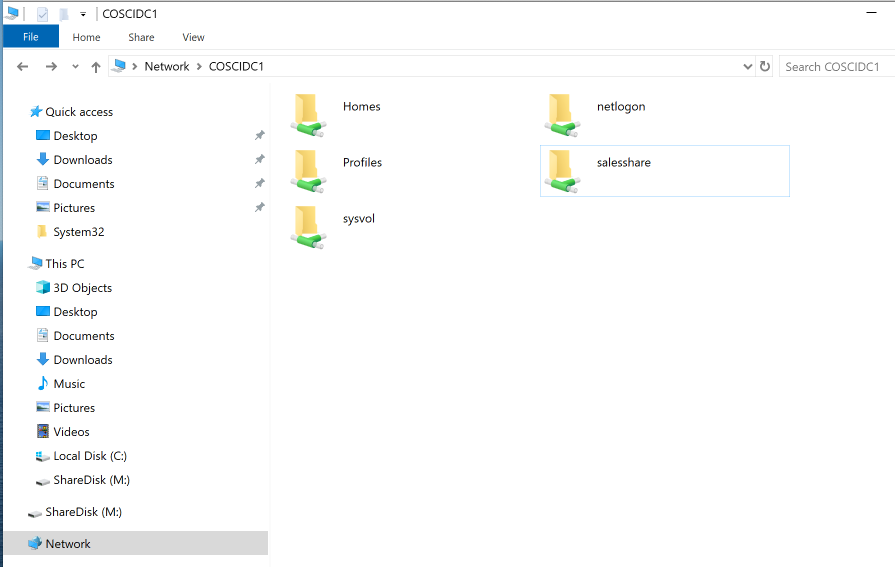

De aandachtige student kan zien dat er twee *gedeelde* folders aanwezig zijn op de domeincontroller die jullie niet hebben aangemaakt: https://www.windowstechno.com/what-is-netlogon-folder-in-active-directory/[netlogon] en https://www.windowstechno.com/what-is-sysvol-folder-in-active-directory/[sysvol].

Deze twee folder zijn **essentieel en noodzakelijk** voor het goed functioneren van de domeincontroller en Active Directory zelf.

IMPORTANT: Het zal duidelijk zijn dat als de sysvol- en de netlogon-folder samen met andere gedeelde folders op een enkele server staan geen goed idee is ... een vergissing of foutje is snel gemaakt.
Daarom is het aangewezen om gedeelde folders op een NAS (network attached storage) te zetten.
Een veel gebruikte NAS-oplossing is https://www.freenas.org/[FreeNAS].

Om een high level overzicht te krijgen van computer storage bekijk volgde https://www.youtube.com/watch?v=XG5cg74UxKs[youtube].

== FreeNAS
We zullen FreeNAS installeren, opnemen in het domein en gedeelde folders aanmaken die beschikbaar zijn voor diverse gebruikers en groepen. 

* Haal de FreeNAS https://www.freenas.org/download/[ISO] af op
** TIP: *No thank you, send me to the Download page please*
* Maak een nieuwe virtueel machine aan en installeer FreeNAS
** Geef je machine maximaal twee GB geheugen en minimaal drie schijven van twintig GB elk
** Selecteer enkel de eerste schijf om FreeNAS op te installeren
** Dit kan even duren ... geduld

image::images/pic3.png[]

Wanneer FreeNAS geïnstalleerd is krijg je onderstaande boodschap en een link waarmee je je kan verbinden tot de user interface van FreeNAS. De gebruikersnaam is *root* en het paswoord is het paswoord dat je ingegeven hebt bij de installatie (p@ssw0rd misschien?) van FreeNAS. 

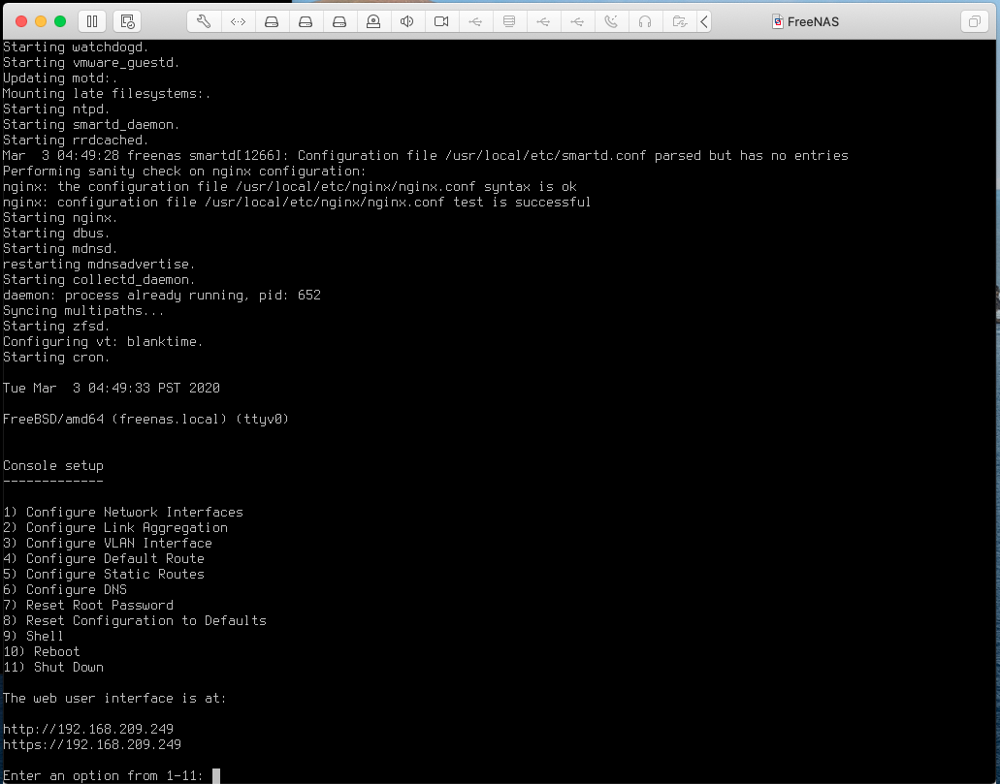

Gebruik een web browser er surf naar het IP-adres dat je terugvindt voor jouw installatie. 

image::images/pic4.png[]

=== Configuratie
* Onder *Network* 
** zet de Windows 2019 Domeincontroller als DNS-server
** verander het domein naar cosci.be
* Onder *Directory Services*
** Kies *AD* en geef de gepaste instellingen mee
** Check *Enable*
** Controleer dat FreeNAS is opgenomen in het domein

== Storage
FreeNAS maakt gebruik van het ZFS bestandsysteem. Dit is een copy-on-write bestandsysteem dat by design normaalgezien niet corrupt kan raken (maar zeg nooit ... https://www.youtube.com/watch?v=vxFNBZIAClc[nooit]). 

Vooralleer netwerkshares gemaakt kunnen worden, moet er eerst opslagplaats voorzien worden. We hebben FreeNAS geïnstalleerd met drie schijven. Van de drie is er één gebruikt voor het besturingsysteem, de twee andere gaan nu gebruikt worden voor netwerkopslag. 

Maak een nieuwe pool aan onder Storage>Pool. Geef deze de naam *opslag* en zorg dat de disks geconfigureerd worden in *Mirror*. Dit komt overeen met een RAID-1 configuratie. 

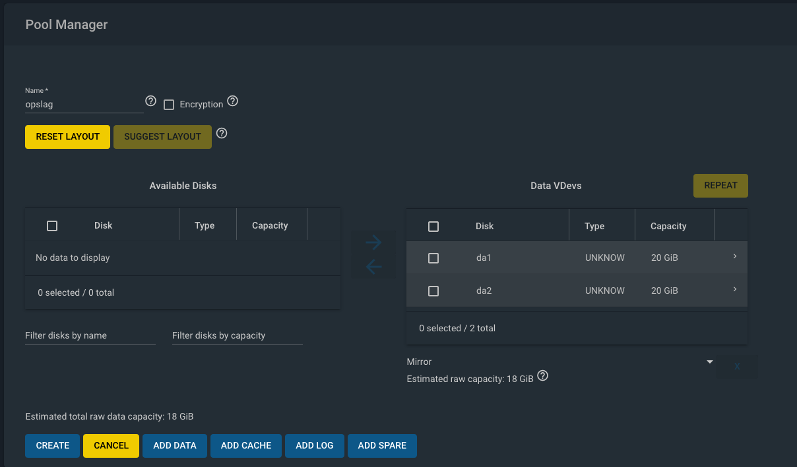

Maak in deze pool een Dataset aan met de naam FreeNAS-TEST. Zoek in de documentatie van FreeNAS op wat een ZFS Dataset is én waarvoor het gebruikt wordt.

== Netwerk Shares
* Kies Sharing
* Kies Windows Shares (SMB)
** Selecteer FreeNAS-TEST
** Maak een share *FreeNAS* aan die alleen leesbaar is door de groep Employee-administration maar Full control geeft aan groep IT-admins.
** Activeer Shadow Copies
*** Zoek in de documentatie van FreeNAS op wat *Shadow Copies* zijn er waarvoor ze gebruikt worden

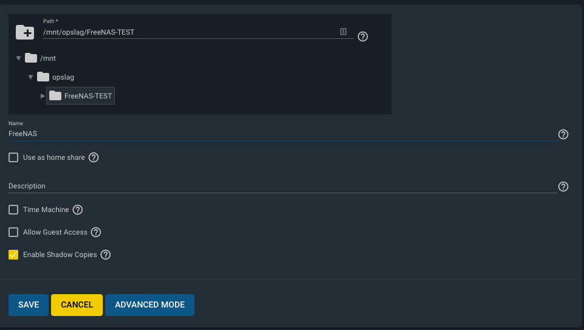

== Backups en Vorige Versies
* Maak in de share FreeNAS een map MAP1 aan
* Maak in MAP1 een bestand FILE1 aan zonder inhoud
* Maak een snapshot onder Storage>Snapshots aan van de dataset FreeNAS-TEST
* Voeg één lijn toe aan het bestand FILE1
* Maak een volgende snapshot van de dataset
* Voeg nog een lijn toe aan bestand FILE1
* Vraag vorige versies op bij de eigenschappen van het bestand

* Verwijder een snapshot en controleer dat er één vorige versie minder is

== Automatische Backups
* Maak een terugkerende taak aan om ieder uur een snapshot te nemen van FreeNAS-TEST
* Deze snapshots moeten na twee weken automatisch verwijderd worden

== iSCSI
Via netwerk Shares kunnen bestanden over een TCP/IP netwerk geraadpleegt worden. Dit wordt kortweg **File Level storage ** genoemd. Bekijk eerst dit https://www.youtube.com/watch?v=ZX5bj0lnZ4Y[filmpje].

Er bestaat ook **Block Level storage**, het equivalent van een "gewone" harde schijf maar die geraadpleegd kan worden via het netwerk. Er bestaan verschillende Block Level storage protocollen en iSCSI is een veel gebruikt protocol in relatief kleine IT-omgevingen. Meer informatie hoe FreeNAS met iSCSI werkt, kan je vinden op puntje 12.2 in volgende https://www.ixsystems.com/documentation/freenas/[link].

=== iSCSI Target
We zullen nu een "disk" aanmaken op FreeNAS en deze via het netwerk beschikaar stellen aan onze domeincontroller. 
Hiervoor moet er eerst een **zvol** aangemaakt worden binnen de pool opslag. Een zvol is een "block device" dat kan geëxporteerd worden naar een systeem over het netwerk. 

* Maak een zvol aan binnen de pool *opslag* en noem die *externe-disk*
* Geef deze 4GB aan opslag
* Ga naar Sharing>Block Shares (iSCSI)
* Onder Target Global Configuration is de iSCSI-naam van de FreeNAS server terug te vinden zoals deze zal gebruikt worden als er verbonden wordt met het iscsi-protocol.

Het proces om een iSCSI-disk beschikbaar te maken op FreeNAS verloopt als volgt:
Maak een **portaal** aan (eventueel met authenticatie) => maak een **target** aan (eventueel met (een andere, dan bij het portaal) authenticatie) => koppel **extend(s)** aan het target. Kort samengevat: een portaal met daarachter een of meerdere targets, met achter elk target een of meerdere extends. 

Nu stap voor stap MET dus twee verschillende authenticatie:

* Maak de twee verschillende gebruikersnamen en paswoorden aan: Group ID 1 met portal-user/portal-secret en Group ID 2 met target-user/target-secret
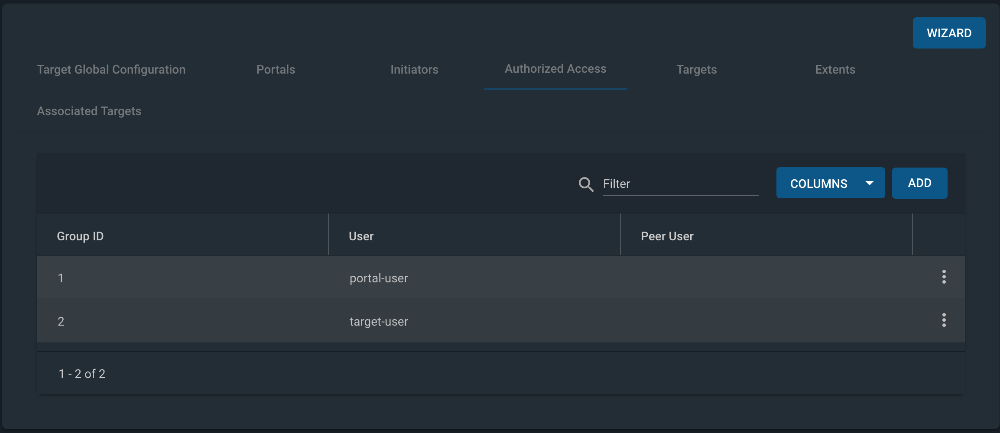

* Maak een portaal aan met naam Portal
** In een NAS kunnen meerdere netwerkkaarten geïnstalleerd worden en niet op al deze netwerkkaarten wil je opslag delen met een netwerk. Daarom kies je een concreet IP-adres en poort om iSCSI-communicatie mogelijk te maken of waarop FreeNAS zal luisteren naar iSCSI-aanvragen. In deze setup is er maar één netwerkkaart kies daarom als IP-adres 0.0.0.0 en poort 3260. Dit wil zeggen luisteren voor iSCSI op alle netwerkkaarten.
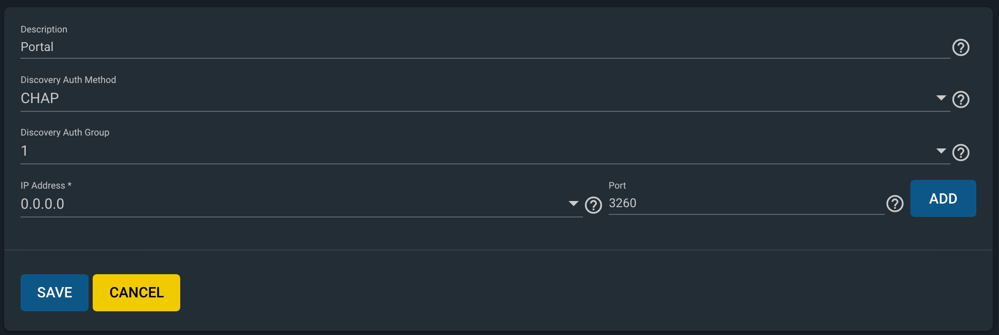

* Niet alle machines mogen verbinden aan de iSCSI-storage, daarom gaan we de toegang beperken aan de Windows Server 2019. hiervoor moeten we de 'iSCSI-naam' van de Windows Server 2019 te weten komen:
** Server Manager => Tools => iSCSI Initiator => Configuration => Initiator Name
** Kopieer deze naam en maak in FreeNAS een initiator aan (Zoek in de documentatie van FreeNAS op wat een IQN is én waarvoor het wordt gebruikt)
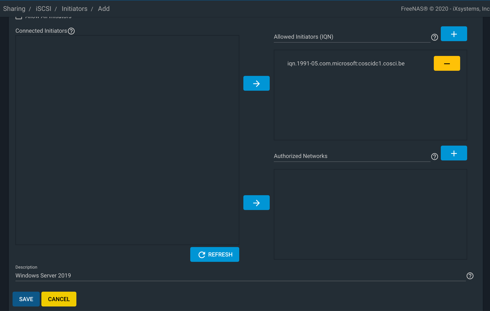

* Maak volgende target aan, let op de correct authenticatie.
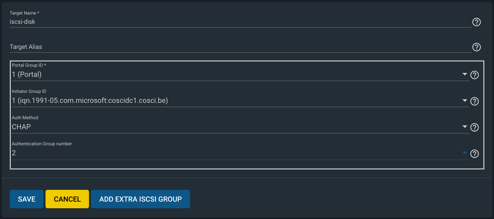

* Voeg nu als laatste stap nog "disken" toe aan de target.
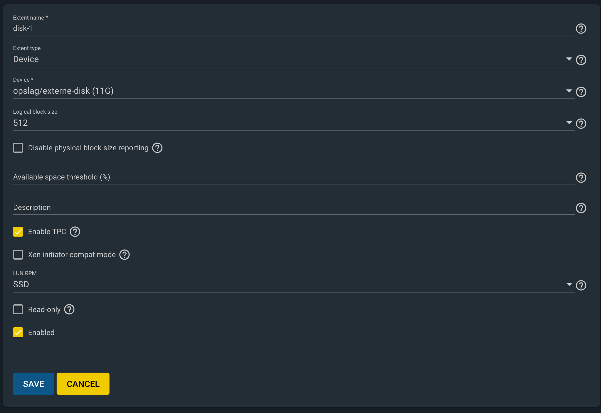

Nadat de extend aangemaakt is, volgt de laatste stap, de Target-Extent association. Click Associated Targets en Add Extent to Target en selecteer Target and Extent van de lijst:
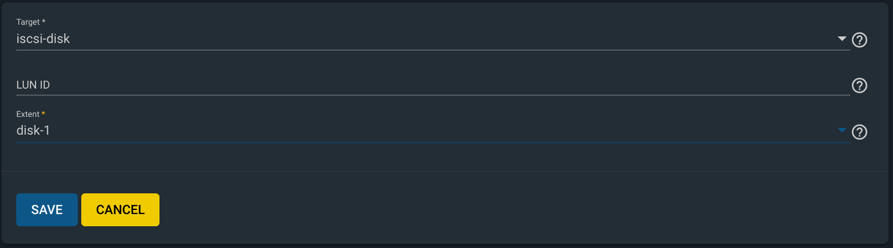
Als je niet meer weet wat een LUN is, kan je dit https://www.youtube.com/watch?v=6s2zCp5IhGg&feature=youtu.be[filmpje] bekijken. 

=== iSCSI Initiator
De FreeNAS server is klaar voor gebruik. Nu moet de Windows Server nog ingesteld worden, open daarvoor opnieuw de iSCSI Initiator.

Configureer zoals hieronder
Discovery => freenas.cosci.be => Advanced
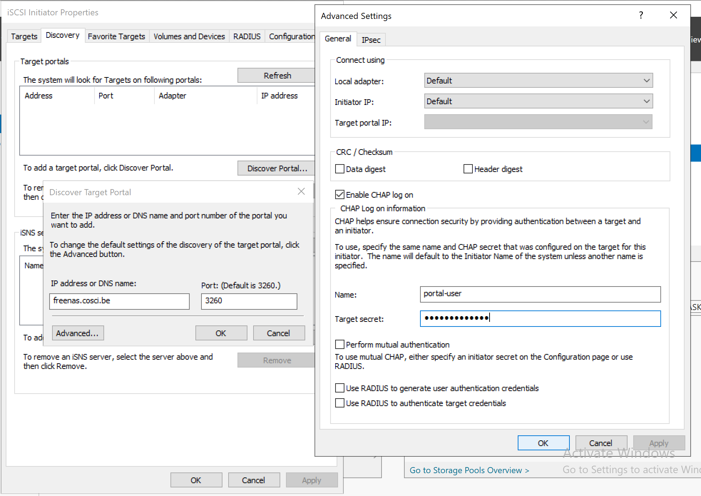
en
Targets => Connect => Advanced 
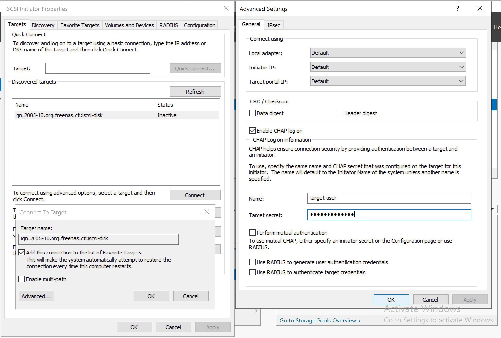

In *Volumes and Devices* => Auto Configure en er zou *iets* moeten bijkomen in de *Volume List*

De "remote disk" is toegevoegd nu moet zo nog online gebracht worden, initialiseren, voorzien worden van een bestandsysteem en een *Drive Letter* **K:**.
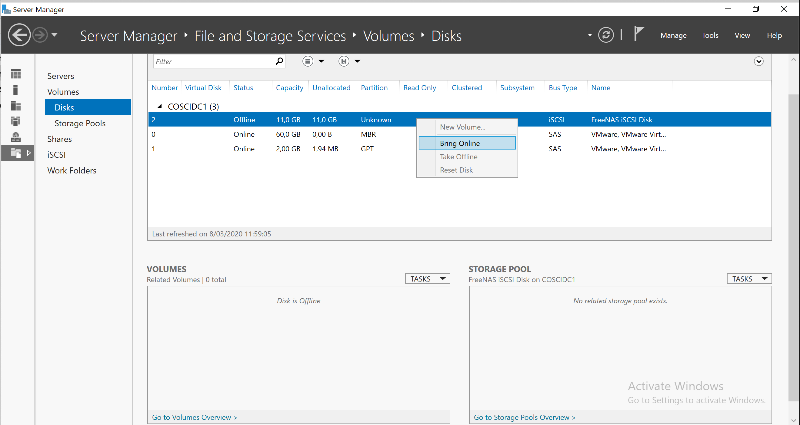
... (probeer zelf eens) ...

== Oepsie ...
Het noodlot kan plots toeslaan ... om dit noodlot "opslagsgewijs" na te bootsen, verwijder je één van de disk en in de FreeNAS pool opslag. Deze disk verwijder je door ze in VMware te verwijderen. Het zou kunnen zijn dat je daarvoor de FreeNAS server dient af te zetten. 

IMPORTANT: verwijder niet de eerste disk of boot disk van FreeNAS nl. da0

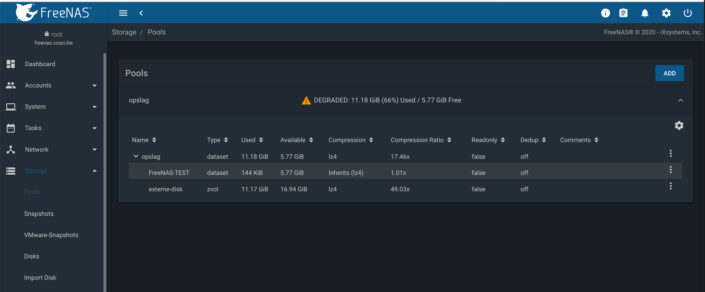
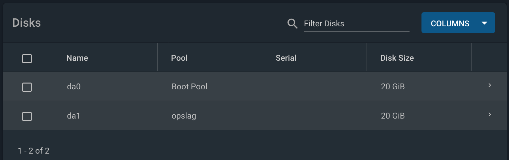

Is de K: schijf in Windows nog steeds toegankelijk?

Sluit FreeNAS terug af en geef je FreeNAS server een nieuwe disk en vervang de verwijderde disk met de nieuwe disk.

Storage => Pools => Tandwiel => Status => Replace 

== Documentatie
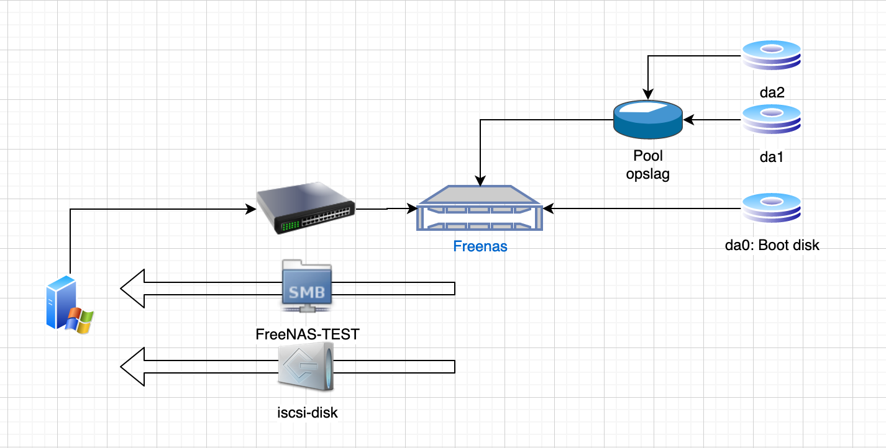
Denk je dat je een beter schema kan maken, ga ja gang en laat je lector/medestudenten genieten van je overzichtelijkheid. 
Tip: draw.io

== Wat moet je na dit labo kennen/kunnen
* Je weet dat een Windows Domein Controller gedeelde folders gebruikt om policies en bestanden naar clients in het domein "te pushen" (begrijpen)
* Je kan een virtuele machine aanmaken in VMware met de gepaste instellingen en virtuele hardware (toepassen)
* Je kan een FreeNAS server opzetten (toepassen)
* Je kan een client (FreeNAS) opnemen in een Windows domein en pas hiervoor de nodige settings aan (op de client) (toepassen)
* Je kan een ZFS storage pool met verschillende datasets en zvols aanmaken (begrijpen-toepassen)
* Je kan de FreeNAS documentatie gebruiken om termen en concepten over FreeNAS/SMB shares/Shadow Copies/... op te zoeken (begrijpen-toepassen)
* Je kan in FreeNAS een (SMB) gedeelde folder aanmaken en voorzien van de gepaste NTFS-permissies (toepassen-analyseren)
* Je kan in FreeNAS snapshots nemen van datasets en hiervoor een automatische taak voor aanmaken (begrijpen-toepassen)
* Je kan in FreeNAS een iSCSI-share aanmaken en aanspreken/gebruiken op een Windows Server (begrijpen-toepassen)
* Je weet hoe in FreeNAS het creatieproces gaat voor het aanmaken van een iSCSI-disk (begrijpen-toepassen)
* Je kan een iSCSI portaal en/of target in FreeNAS voorzien van CHAP authenticatie (CHAP=challence authentication protocol) (toepassen)
* Je kan op Windows Server 2019 een iSCSI-initiator installeren en configureren (toepassen)
* Je kan op Windows Server 2019 een disk voorzien een een bestandsysteem en drive letter (toepassen)
* Je kan in FreeNAS in een degraded mirror-pool de defecte disk vervangen door een nieuwe (analyseren)
* Je een (eenvoudig) netwerkschema maken van een storage-IT-oplossing (analyseren-evalueren-creëren)
