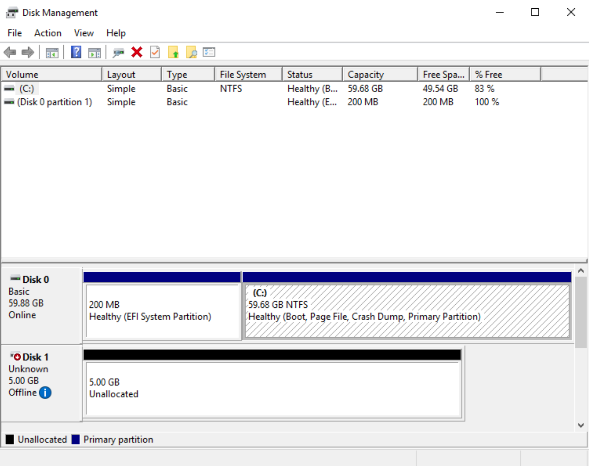
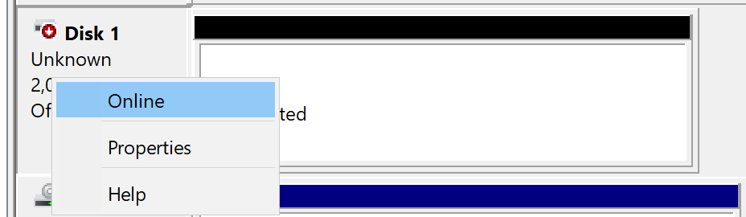
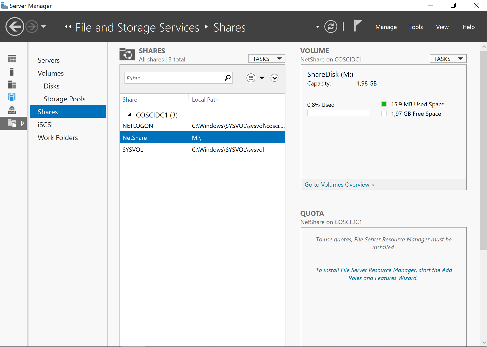
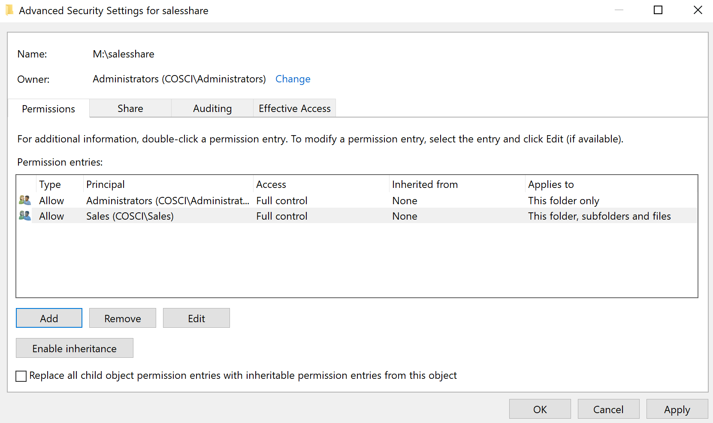
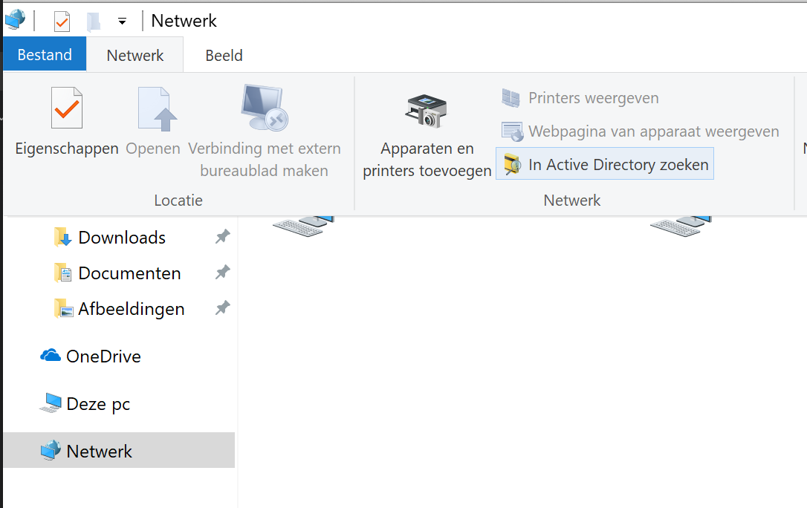

= Storage, shares en rechten
UCLL
:doctype: article
:encoding: utf-8
:lang: nl
:toc: left

== Inleiding
In dit labo gaan we netwerkopslag onder de loep nemen, meer bepaald shares, rechten op deze shares en NTFS-permissies. Echter, om hieraan te beginnen gaan we eerst wat theorie over opslag bekijken.

== Voorbereiding
Installeer als je dit tot nu toe nog niet gedaan zou hebben op je *server* én *client* de VMWare tools.

Om dit labo tot een goed einde te brengen heb je het volgende nodig:

* Een instantie van Windows Server 2019 met Active Directory
* Een instantie van Windows 10, opgenomen in het domein

Voeg aan je Windows Server 2019 een extra schijf toe. Dit kan je eenvoudig doen in VMWare, onder de instellingen van de VM. 

Wanneer je dit gedaan hebt, start de VM en ga in Windows naar Computer Management>Disk Management. Hier zie je normaal gezien het volgende:

Bij Disk 1, de schijf die je net hebt toegevoegd krijg je de melding *The disk is offline because of a policy set by the Administrator*. We kunnen de disk gemakkelijk online zetten door er recht op te klikken en online te brengen.

Initialiseer de disk daarna door opnieuw rechts te klikken op de disk. Met rechtermuisknop kiezen we voor 'Initialize Disk' en gebruik GPT. Nu is de status van de disk *Online*. Toch zal de disk nog altijd niet werken, omdat we nog een bestandsysteem moeten installeren. Dit kan je doen door met rechtermuisknop te kiezen voor *Nieuw Volume*. 

image::images/pic3.png[]

Je volgt de standaard waarden, kent een Drive-letter M: toe, en gebruikt NTFS als filesysteem en geeft het volume het "label" ShareDisk. Als je dit gedaan hebt, zal je de nieuwe disk in je Verkenner terugvinden.

== Sharing
Nu willen we onze **ShareDisk** delen met andere pc's op het netwerk. In Verkenner ga je naar de eigenschappen van de schijf M\: en ga je naar de tab 'Sharing'. Klik door naar 'Advanced Sharing'. Bovenaan vink je 'Share this folder' aan en geeft de share de naam 'NetShare'. Sluit dit menu af, en je zal zien dat in de verkenner nu een klein icoontje is verschenen bij de disk. Maak tenslotte een klein bestandje aan in deze map, zodat we hiermee kunnen testen.

image::images/pic4.png[]

Ga nu naar de Windows 10 PC, en probeer deze share te vinden. Wanneer je hem open doet, kijk of je het tekstbestand kan openen, lezen, bewerken, nieuwe bestanden kan aanpassen, ... Normaal gezien kan je vanop de client PC niets aanpassen, enkel lezen.

Voor je verdergaat, bekijk eerst dit https://www.youtube.com/watch?v=GfmkD12ywfw[filmpje over Share & NTFS-rechten], lees je deze https://blog.netwrix.com/2018/05/03/differences-between-share-and-ntfs-permissions/[blog post] en probeer er zelf ook wat mee uit. Nu we dit hebben getest, weten dat dit werkt, kunnen we aan het echte werk beginnen.

We schakelen eerst en vooral de share op de disk terug uit. In de Server Manager ga je naar File and Storage Server. Hier selecteer je Shares.

Verwijder het testbestand en maak volgende mappen aan in M\: nl. **SalesShare**, **HRShare** en **EngineeringShare**. We gaan deze mappen omzetten naar shares, niet meer op de manier zoals hierboven, maar via de Server Manager. Het resultaat zal hetzelfde zijn als hierboven, maar we houden een beter overzicht over al onze netwerk-shares.

Onder Tasks kiezen we voor een nieuwe share en maken we een _SMB Share - Quick_ aan. Je geeft het pad van de SalesShare-folder op en geeft de share een naam. Wanneer we bij permissions komen willen we het een en het ander aanpassen, dus we klikken op **Customize permissions ...**. Eerst en vooral kiezen we voor Disable Inheritance. Hierna voegen we de groep sales toe, en geven we hen "Full control"-rechten op de share. Het eindresultaat ziet er zo uit:

We doorlopen de wizard verder, en wanneer we de share hebben gemaakt, testen we met verschillende gebruikers of de permissies kloppen (Mensen niet in sales kunnen niet aan de Sales-share, mensen die wel in de sales groep zitten kunnen wijzigen, ...)

IMPORTANT: Als je permissies aanpast, moet de gebruiker op de client zich eerst opnieuw aanmelden alvorens deze permissies toegepast worden. Je kan ook subfolders aanmaken met afwijkende permissies. Dit doe je door in de verkenner een map aan te maken, en daar onder **security** de gewenste permissies in te stellen.

== Shared folders in Active Directory
Je kan netwerkshares ook toevoegen aan Active Directory. Hiervoor kies je in Active Directory Users and Computers voor Action>New>Shared Folder. Hier moet je een naam en een pad meegeven. Als je nadien onder properties gaat kijken, kan je ook keywords toevoegen. Deze keywords kan je gebruiken om te zoeken via de Verkenner.

Probeer een keyword financial toe te voegen, en kijk daarna of je op de Windows 10 PC de share kan terugvinden via onderstaand menu en het juiste keyword. Daarnaast kan je, eens je shared folder in Active Directory zit, ook dit object gebruiken in Group Policy Objects.

== Oefeningen
=== Netwerkshares voor iedereen
* Sales, Engineering, HR en IT willen allemaal hun eigen netwerkshare. Deze moet voor iedereen in de respectievelijke OU automatisch toegevoegd worden als de Z-schijf (netwerkkoppeling) d.m.v. een GPO. Maak de nodige GPO's aan en test die voor een gebruiker in de OU *HR* en *IT*.
* In de HR-map zit er een map personeelsbestanden, met daarin een folder per werknemer, bijvoorbeeld 'Hans Van de Gieter'. De gebruiker Hans Van de Gieter heeft leesrechten op deze folder en krijgt deze folder automatisch toegevoegd als Y-schijf, maar kan natuurlijk niet de folders van andere werknemers bekijken. HR kan deze folder volledig beheren. Werkt dit uit voor de gebruiker "Hans Van de Gieter". Zet de nodige rechten op de folders binnen de map personeelsbestanden en maak voor alle gebruikers binnen cosci.be een gepaste GPO aan om de personeelsfolder te mappen op Y-schijf. 

=== Home folders
Wanneer een gebruiker zich aanmeldt op een computer, kan hij zijn persoonlijke bestanden opslaan in een home folder (N. basismap). Met zijn persoonlijke bestanden doet een gebruiker wat hij wil. Anderen hebben geen toegang. Een home folder heeft best als naam de naam van de eigenaar en wordt best bewaard op een NTFS-partitie (op FAT-partities kan je een folder niet afschermen van andere gebruikers). Typisch worden ze bewaard als subfolders van dezelfde folder, dus iets als:

    …\Gebruikers
    Gebruiker1
    Gebruiker2
    …

Aangezien gebruikers zich op eender welke computer in het domein kunnen aanmelden, moeten we zorgen dat de home folders centraal toegankelijk zijn (d.w.z. ze moeten staan op een server waar alle computers in het domein aan kunnen. In dit geval gaan we de domeinserver gebruiken als locatie voor onze home folders, maar in principe kan het ook eender welke andere server in het domein zijn. Lees verder ... .

==== Gedeelde map maken
Log in als Administrator op de domein controller, en maak een nieuwe map **HomeFolders** aan op de M:\ en maak hier een share **Homes** voor aan met volgende Permissions zoals hieronder:

image::images/pic8.png[]

In deze map zullen alle gebruikersprofielen opgeslagen worden (in een aparte directory per gebruiker). Rechterklik op de map M:\HomeFolders, en ga naar Properties, Security, Advanced. De lijst van machtigingen die je hier ziet staan. Voeg de volgende permissies toe voor de groep **Everyone** (klik op Show advanced permissions om alle permissies te zien):

* Traverse folder/execute file
* List folder/read data
* Read attributes
* Create folders/append data

Zorg er ook voor dat deze permissies toegepast worden op **This folder only**. Dit zorgt er voor dat iedereen de HomeFolders-map kan bekijken, maar dat niemand automatisch rechten krijgt in de onderliggende mappen.

==== De home folder instellen
Open Active Directory Users and Computers, ga naar een account, rechterklik, en ga naar Properties, Profile, Home folder. Stel dit zo in dat er een verbinding komt tussen H: en een subdirectory van de HomeFolders-map (bijv. \\COSCIDC1\Homes\%username% – de %username% zal automatisch vervangen worden door de gebruikersnaam). Doe dit voor een gebruiker sales1 en Hans Van de Gieter. Log in op de Windows 10-machine als sales1, en verifieer dat er inderdaad een (netwerk)schijf H:\ aanwezig is waar je een tekstdocument kan op bewaren. Controleer ook dat je geen toegang hebt tot de basismappen van andere gebruiker zoals Hans Van de Gieter.

=== Folder redirection
Elke gebruiker heeft nu zijn eigen basismap (die automatisch verbonden wordt aan de H:\ wanneer hij inlogt), maar de folders zoals Documenten, Bureaublad, e.d. verwijzen nog altijd naar een map op de lokale computer. Wanneer de gebruiker hier dus iets opslaat en zich later aanmeldt op een andere computer, dan zal hij die bestanden daar dus niet terug vinden.
Active Directory laat echter ook toe om deze speciale mappen voor elke gebruiker automatisch door te laten linken naar de basismap. Aangezien de basismap een gedeelde map is die overal toegankelijk is, zal de gebruiker dus op elke computer al zijn bestanden zien staan.

Open het groepsbeleidsbeheer en maak onder de OU Employees een nieuwe GPO (rechterklik, Create a GPO in this domain and …). Geef het GPO de naam Redirect Folders en bewerk het. Ga naar User configuration, Policies, Windows Settings, Folder Redirection, Documents. Rechterklik, en open de eigenschappen. Zet de instelling op Basic: redirect everyone’s folder tot he same location en stel de locatie van de doelmap in op Create a folder for each user under the root path. Als Root Path stel je de netwerklocatie van de home folders in (\\COSCIDC1\Homes). Sluit de editor af, en log in op de Windows 10-machine als sales1. Controleer dat de Documenten-map nu verwijst naar de basismap van die gebruiker. Het kan zijn dat je twee keer moet aanmelden alvorens de wijziging doorgevoerd is.

=== Roaming Profiles
Met Home Folders kunnen we aan elke gebruiker een basismap toekennen die beschikbaar is via het netwerk (een gedeelde map dus). Met folder redirection kunnen we vervolgens de standaardfolders (Documenten, Bureaublad, …) laten verwijzen naar die basismap. Zo kan een gebruiker op eender welke computer aan zijn data. Als laatste kunnen we Active Directory instellen dat de gebruiker op elke computer eenzelfde user experience krijgt door zijn gebruikersprofiel zwervend (E. roaming) te maken.
Het profiel voor een gebruiker bevat de instellingen van de gebruiker. Zo bevat het onder andere:

* het uitzicht van het bureaublad (achtergrond, snelkoppelingen, etc.)
* de schermresolutie
* langs welke kant van het scherm de taakbalk hangt
* …

Als een gebruiker voor het eerst inlogt op een PC, wordt voor deze gebruiker een profiel gecreëerd. Gebruikersprofielen worden standaard lokaal opgeslagen. Hierdoor kan elke gebruiker op elke computer dus een ander profiel hebben, maar dit is wellicht ongewenst. Als een gebruiker wijzigingen aanbrengt (bvb. aan de achtergrond van het bureaublad) dan worden deze wijzigingen opgeslagen in zijn profiel dat lokaal bewaard wordt. Als dezelfde gebruiker op dezelfde computer weer inlogt, krijgt hij hetzelfde profiel.
Door het profiel zwervend te maken, wordt het centraal opgeslagen. De gebruiker krijgt dan hetzelfde profiel ongeacht de computer waarop hij werkt. Bij het aanmelden wordt het profiel opgehaald van de server en lokaal opgeslagen. Wanneer de gebruiker afmeldt, wordt het lokale profiel teruggestuurd naar de server.

Maak op de M:\ een nieuwe map én share *Profiles* aan, waarvan je de share- en NTFS-permissies zo instelt als op de HomeFolders-map (zie eerder).
Open Active Directory – gebruikers en computers en ga naar de account sales1. Rechterklik, en ga naar Properties, Profile, User profile. Als Pad naar gebruikersprofiel stel je een subdirectory in op de gedeelde Profiles-map (bijv. \\COSCIDC1\Profiles\%username%).
Log in op de Windows 10-machine als gebruiker sales1 en bekijk de inhoud van de profieldirectory in de gedeelde Profiles-map (\\COSCIDC1\Profiles\). De map zou leeg moeten zijn. Maak nu een snelkoppeling aan op het bureaublad (bijv. naar C:\Windows\notepad.exe) en verzet de taakbalk van kant (bijv. bovenaan het scherm). Meld af en meld terug aan. Ga opnieuw naar de profieldirectory, en merk op dat er nu heel wat mappen en bestanden in staan. Deze zijn naar daar gekopieerd tijdens het afmelden. Als we nu een tweede Windows 10-machine hadden, dan zou je zien dat je profiel ook daarop toegepast wordt.

=== Installaties 
Daarnaast hebben we in M\: ook een Shared Folder genaamd Distributie. In deze folder staat een MSI-bestand, die we via een Group Policy op alle PC's installeren. Natuurlijk mogen gebruikers deze share niet kunnen aanpassen, omdat ze wel eens malafide programma's erop kunnen zetten, die dan geïnstalleerd worden.

=== Quota
Ten slotte weten we ook van de divisie engineering dat ze vaak veel te grote bestanden op hun share zetten. Daarom willen we hun share limiteren tot 2 Gigabyte en dat er een mailtje naar admin@cosci.be gestuurd wordt wanneer 95% in gebruik is. Het kan zijn dat je hier extra features voor moet installeren op de Windows Server (tip: Quota maakt deel uit van File System Storage Management).

== Referentie (lezen ter info)
=== NTFS-permissies voor folders
Voor een folder op een NTFS-permissie kunnen groepen (of eventueel individuele accounts) volgende (standaard)-permissies krijgen:

* List folder contents. Wie op folder F deze permissie heeft, kan de inhoud van F (lijst van bestanden en subfolders) lezen.
* Read. Wie op folder F deze permissie heeft, kan:
** de inhoud van F lezen, zoals bij de vorige permissie,
** de inhoud van bestanden en subfolders van F lezen,
** attributen, permissies en eigendomsrechten van F lezen.
* Read & execute. Wie op folder F deze permissie heeft, heeft de readpermissie maar bovendien ook de zgn. traverse-permissie. Dit is nuttig in volgende situatie: een folderstructuur: ...\dir1\F. Wie geen permissie heeft op dir1 en "read & execute"-permissie heeft op F kan niet bladeren via verkenner en zo naar F gaan maar het kan wel door de volledige padnaam op te geven.
* Write. Wie op folder F deze permissie heeft, kan:
** in F bestanden en subfolders creëren,
** in F bestanden en subfolders verwijderen,
** de attributen van F wijzigen,
** de permissies en de eigendomsrechten van F lezen maar niet wijzigen.
* Modify. Wie op folder F deze permissie heeft, kan:
** alles wat iemand met de "read & execute"-permissie kan,
** alles wat iemand met de "write"-permissie kan,
** F ook verwijderen.
* Full control. Wie op folder F deze permissie heeft, kan:
** alles wat iemand met de "modify"-permissie kan,
** de permissies en de eigendomsrechten van F en zijn subfolders en bestanden wijzigen.

=== NTFS-permissies voor bestanden
De zopas opgesomde permissies kunnen ook toegekend worden voor individuele bestanden. Sommige hebben uiteraard een enigszins andere betekenis.
* Read. Wie op bestand B deze permissie heeft, kan:
** de inhoud van B,
** attributen, permissies en eigendomsrechten van B lezen.
* Read & execute. Wie op bestand B deze permissie heeft, kan:
** alles wat iemand met de "read"-permissie kan,
** B ook laten uitvoeren (als B een uitvoerbaar bestand is).
* Write. Wie op bestand B deze permissie heeft, kan:
** B wijzigen,
** de attributen van B wijzigen,
** de permissies en de eigendomsrechten van B lezen maar niet wijzigen.
* Modify. Wie op bestand B deze permissie heeft, kan:
** alles wat iemand met de "read & execute"-permissie kan,
** alles wat iemand met de "write"-permissie kan,
** B bovendien ook verwijderen.
* Full control. Wie op bestand B deze permissie heeft, kan:
** alles wat iemand met de "modify"-permissie kan,
** de permissies en de eigendomsrechten van B wijzigen.

==== Toepassing van NTFS-permissies
Voor elk van deze permissies kan de instelling toegekend (allow) of geweigerd (deny) zijn, of geen van beide. Een account kan in meerdere groepen zitten, waarbij de verschillende groepen andere rechten toekennen aan een bepaald object (map, file). Als men als lid van één groep permissie heeft, dan krijgt de gebruiker toegang, tenzij er ergens anders "geweigerd" staat. Als men behoort tot een groep waarvoor een permissie geweigerd is, heeft men die permissie niet, ongeacht welke de permissies zijn van andere groepen waarvan men ook deel uitmaakt.
Een folder erft de permissies van de bovenliggende folder, d.w.z.: als iemand een permissie heeft op een folder dan heeft hij die in principe ook op een subfolder. Men kan dit overerven echter wel blokkeren.

NTFS-permissie zijn van toepassing als een gebruiker lokaal (= aan de computer zelf) werkt, maar ook als hij over het netwerk (bijv. met een gedeelde map) werkt. Andere bestandssystemen, zoals FAT32 en exFAT ondersteunen het concept van permissies niet; daar hebben alle gebruikers toegang tot alle bestanden. Het toekennen van NTFS-permissies gaat via Windows Verkenner door te rechterklikken op de map of het bestand en te gaan naar Properties, Security.

Onafhankelijk van de share-permissies zijn de NTFS-permissies altijd van toepassing (dus onafhankelijk of het object via het netwerk of lokaal gebruikt wordt). Voor netwerkobjecten gelden dus zowel de share- als NTFS-permissies. De meest restrictieve permissie is de eigenlijke permissie.

=== Gebruikers en gebruikersgroepen (AGDLP)
Gebruikersbeheer is wellicht de meest complexe taak van een netwerkbeheerder. Zoals we hierboven gezien hebben, wordt toegang tot bestanden en andere bronnen geregeld via permissies. 

Het is onverstandig permissies te geven aan individuele gebruikers. In plaats daarvan worden **globale groepen** gecreëerd. Gebruikers worden dan ondergebracht in globale groepen (een gebruiker kan tot meerdere groepen behoren). De term *globaal* verwijst ernaar dat de groep op het ganse domein bestaat.
Sinds Windows 2000 bestaan er ook universele groepen. Dit type groep is nuttig wanneer meerdere domeinen via een netwerk verbonden zijn en als gebruikers van het ene domein toegang moeten hebben tot hulpbronnen van het andere domein.
 lees volgende https://ss64.com/nt/syntax-groups.html[tekst].

Permissies worden toegekend aan domein-gebonden groepen (E. domain local). De beheerder kan individuele gebruikers of globale groepen toekennen aan zo een domein-gebonden groep.

== Wat moet je na dit labo kennen en kunnen
* Je kan Windows machines voorzien (installeren) van VMWare Tools (toepassen)
* Je kan in VMware een virtuele machine aanpassen i.f.v. virtuele hardware (disks toevoegen en verwijderen) (creëren)
* Je kan op Windows Server 2019 een disk voorzien een een bestandsysteem en drive letter (toepassen)
* Je kent het verschil tussen share en NTFS permissies en kan deze ook correct toepassen (onthouden-begrijpen-toepassen)
* Je kan op Windows 2019 via Server Manager een share aanmaken en configureren (toepassen)
* Je kan een shared folder opnemen in AD en deze gebruiken in GPO's (toepassen)
* Je kan voor gebruikers in AD Home-folders aanmaken op een gedeelde folder met de correcte NTFS-permissies (toepassen)
* Je kan roaming profiles instellen voor een gebruiker in AD d.m.v. de eigenschappen van de gebruiker aan te passen (toepassen-analyseren)
* Je kan opzoeken wat er met AGDLP bedoeld wordt en je kan het concept uitleggen aan een leek (begrijpen)
